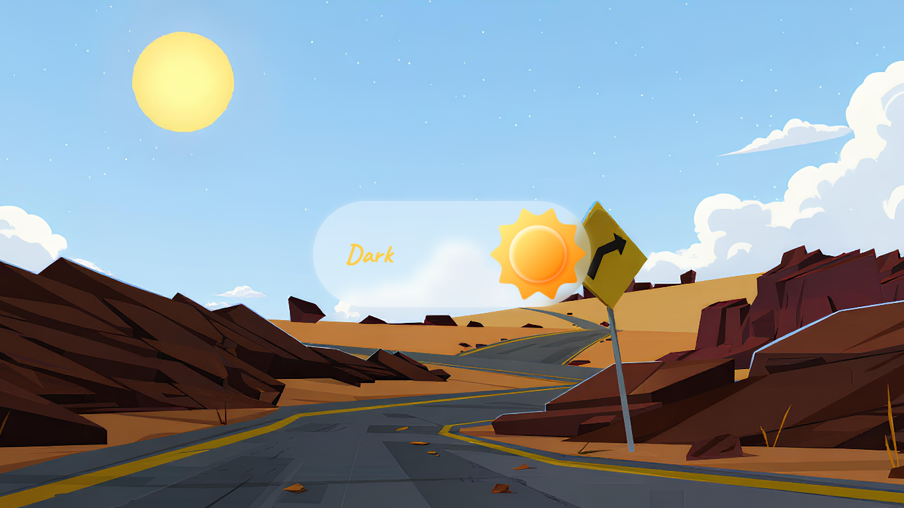

# 🌗 Dark/Light Mode Toggle

A beautiful and customizable dark/light mode toggle switch with glowing sun and moon icons. Built using **HTML, CSS, and JavaScript**, this toggle is perfect for any website or web app needing theme switching functionality with visual flair.

---

## ✨ Features

- 🔘 **Glowing circular toggle knob**
- 🌞/🌙 **Custom icon switching** (sun for light mode, moon for dark mode)
- 🎨 **Smooth animated transitions**
- 🖼️ **Theme-based background image switching**
- 💡 Fully responsive and scalable (adjust size easily)
- 📦 No frameworks or dependencies — pure HTML/CSS/JS

---

## 🚀 Demo

You can view a live version here:  
[🔗 Live Demo](https://dark-light-mode-green-eight.vercel.app/)

---

## 📂 Project Structure
```bash
project/
├── index.html # Main HTML file
├── style.css # All styles including knob, icon, labels
├── icons/
│ ├── sun.png # Sun icon for light mode
│ └── moon.png # Moon icon for dark mode
└── images/
├── light-bg.jpg # Background for light theme
└── dark-bg.jpg # Background for dark theme
```

---

## 📦 How to Use

1. **Clone the repository** or download the ZIP
2. Add your own `sun.png` and `moon.png` icons in the `/icons/` folder  
   *(Recommended: 512×512px transparent PNG or SVG)*
3. Add background images in `/images/` and update paths in `style.css`
4. Open `index.html` in your browser

---

## 🛠️ Customization

You can adjust:
- **Track size** → Change `width`/`height` of `.toggle-track`
- **Knob size** → Modify `.knob` width/height
- **Transition speed** → Adjust `transition` properties
- **Background image per theme** → Set `background-image` in `body` and `body.light-theme`

---

## 🔧 Technologies Used

- HTML5
- CSS3 (Flexbox, Transitions, Drop Shadow,media queries)
- Vanilla JavaScript

---

## 📸 Screenshots

### Dark Mode


### Light Mode


---

## 📝 License

This project is open-source and free to use under the [MIT License](LICENSE).

---

## 🙌 Credits

- **Icons**: [Flaticon](https://www.flaticon.com/)
- **Backgrounds**: [Freepik](https://freepik.com/)
- **Inspiration**: [Video Link](https://www.youtube.com/watch?v=sX3Lw9xHdSk&t=155s)

---
